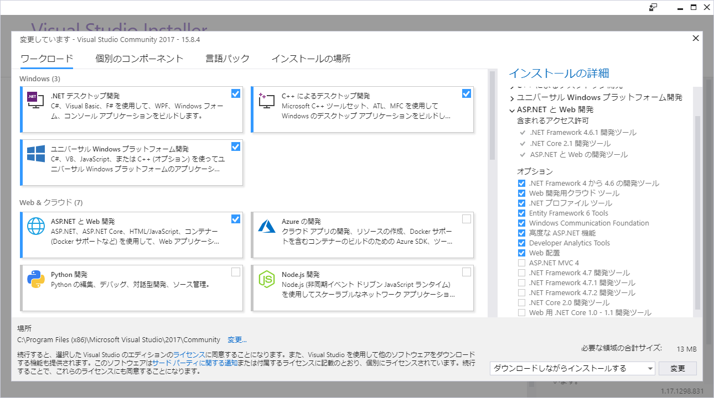

# HARUKA 外部操作ツールセット
このリポジトリには、HARUKAに対して一定の操作を外部から行うためのライブラリ、またそのライブラリを利用したCLIツールおよびWebアプリケーションのプロジェクトが含まれています。
ライブラリを使用することでユーザー独自のプログラムから加工データの送信、HARUKAの状態取得といった操作を行えます。またWebアプリに応用して遠隔PCからそれらの操作を行うといったことも可能です。その実装の一例がolhrk_webです。
olhrl_webのビルド済バイナリも配布しており、[olhrk_webのリリースページ](https://github.com/OHLASER/olhrk_web/releases) からご参照いただけます。

対象OS:Windows 10
開発環境:Visual Studio 2017

## 導入
このgitリポジトリはサブモジュールを含むので、クローン時にそれらの取得も必要です。
具体的には以下のようにコマンドを実行してください。
```sh
git clone https://github.com/OHLASER/olexttool --recursive
```

## ファイル/ディレクトリ構成
導入の作業後、以下のようなファイル構成となります。
|  ディレクトリ  |  説明  |
| ---- | ---- |
|  msvs  |  外部操作に関する各種プロジェクトを含むソリューションファイル(olhrk_client_0.sln)が含まれています。  |
|  oldlclr  |  CLIツール/Webアプリ共通で使用されるHARUKA操作用ライブラリの.NETプロジェクトが含まれます。olhrk_client_0.slnに参照されています。  |
|  olhrk_client  |  CLIツールの.NETプロジェクトが含まれます。olhrk_client_0.slnに参照されています。  |
|  olhrk_web  |  WebアプリのASP.NETプロジェクトが含まれます。olhrk_client_0.slnに参照されています。  |
|  docs  |  本ドキュメントの画像等リソースを含みます。  |
|  README.md  |  本ドキュメントです。  |

## 各プロジェクトの概要

### oldlclr - HARUKA通信用モジュール
oldlclrは、実行中のHARUKAを制御するためのC#ライブラリです。HARUKAとのプロセス間通信を行います。
仕様の詳細は[oldlclr/README.md](https://github.com/OHLASER/oldlclr)を参照ください。

### olhrk_web - 外部操作CLIサンプル
olhrk_webはC#で記述されたASP.NET Webアプリケーションです。HARUKAに対して一定の遠隔操作が可能です。HARUKAが動作しているWindowsでIISを起動して使用します。httpプロトコルを通じて、HARUKAの状態取得、データ転送を行うことができます。
HARUKAとの通信は以下のようにREST APIを通して行われます。
* HTTP[GET] Home/Staus 
 json形式のHARUKAの状態を取得することができます。
* HTTP[POST] Home/Load 
 加工データを本文に追加することで、HARUKAにデータ転送を送ることが出来ます。
 

olhrk_webの使用方法、注意点等については[olhrk_web/README.md](http://github.com/OHLASER/olhrk_web)を参照ください。

### olhrk_client - 外部操作Webアプリサンプル
HARUKAが動作しているWindowsで実行できるC#実装のコンソールプログラムです。コマンド引数を利用して、HARUKAの状態取得、加工データの転送などが行えます。当該プログラムの利用方法は、IISを利用しないWebサーバを構築する場合に使用します。

## 備考

### ワークロード
弊社では、図示のワークロードを使用しています。コンパイルエラーなどのエラーが生じた場合の参考にしてください。


